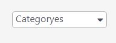

# Greating my own component library
  
  for learning purposes and to develope it and use it in the futuer i have published my own library  
  
  you can visit the package here to check it or use it  
  https://www.npmjs.com/package/sharlq-comp-lib  

# components
## Select  
  
its hard to syle the HTML select so i ahve created select component that can be styled easily  

it take two props  
1. items : an array that has the items of the list
1. onItem : a function that git triggered when you press the item this function have its list item as an argument

### usage
```ruby
import {Select} from 'sharlq-comp-lib'
 <Select
  title={"Select From"},
    items={["firstItem","secondItem","thirdItem"]},
    onItem = {handleItemFunction},
    width = {"175px"}}/>

```

  

## Button
a simple customizable button
  
  ### usage
```ruby
import {Button} from 'sharlq-comp-lib'
 <Button
  label={"press here"},
   {...props}/>

```
## Card
i have added a simple card   
there is also CardImg compnent to provide container to add image to the card  
and also the CardBody component that provides a container to add text to the card  

  
note here both the CardImg and CardBody are optional
  
  

  ### usage
```ruby
import {Card,CardImg,CardBody} from 'sharlq-comp-lib'
 <Card>
 <CardImg src={"url"} alt={"message"}/>
 <CardBody>
 {children}
 </CardBody>
 {children}
 </Card>

```

## Animated Card

i have created animated card that hovers relative to the position of your cursor over it


### usage
```ruby
import {CardAnimated} from 'sharlq-comp-lib'
 <CardAnimated>
 {children}
 </CardAnimated>

```